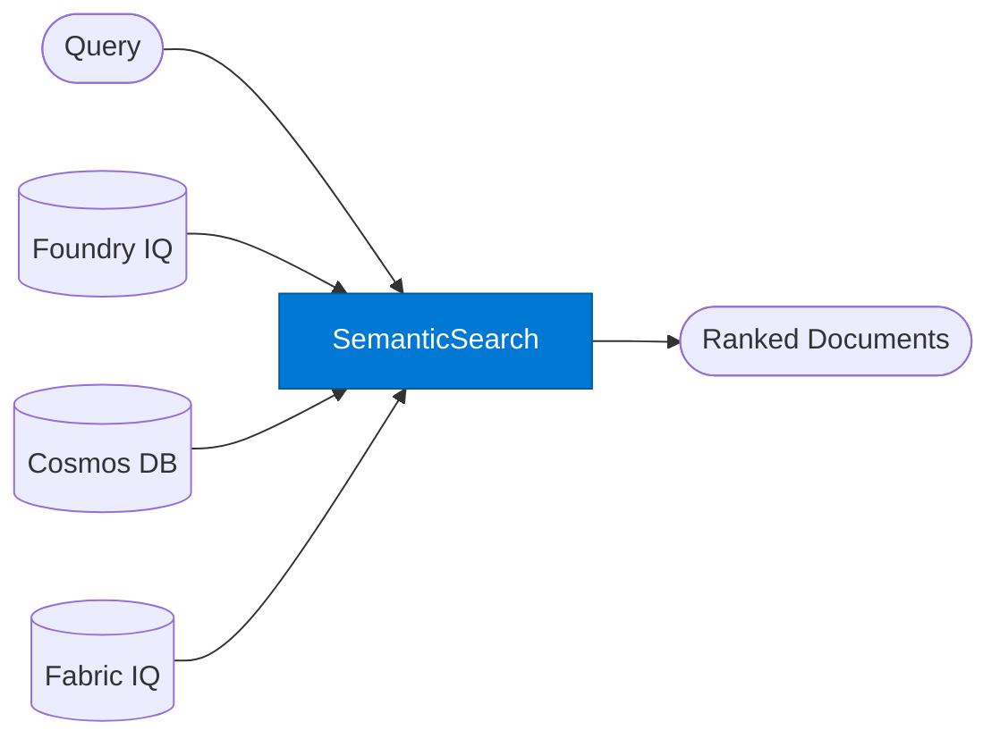

# Semantic Search Agent

_Returns semantically ranked documents from org knowledge stores without generating an answer._

## Overview

The Semantic Search agent performs multi-source semantic retrieval and returns the ranked list of matching documents — it does not synthesise or generate an answer. Use it when you need direct access to source material, when you want to build your own answer generation pipeline, or when you need faceted search results for a UI.

## Pattern Diagram



## Contract Specification

### Inputs

**search_request** (object, required):
- `query` (string, required): Search query in natural language
- `sources` (array, optional): Sources to search — `["foundry", "cosmos", "fabric"]` (default: `["foundry"]`)
- `top_k` (integer, optional): Maximum results to return (default: 10)
- `filters` (object, optional): Metadata filters e.g. `{ "doc_type": "policy", "region": "EMEA" }`
- `rerank` (boolean, optional): Apply semantic reranking (default: true)

### Outputs

**search_results** (object):
- `results` (array): Ranked documents — each with `title`, `content_snippet`, `source`, `score`, `url`
- `total_found` (integer): Total matching documents before `top_k` truncation
- `query_expansion` (string, optional): Query terms added during semantic expansion

## Azure Tools

| Tool ID | Display Name | Service | Purpose |
|---|---|---|---|
| `iq-foundry` | Foundry IQ | Indexed org knowledge via Azure AI Search | Primary — powered by Azure AI Search semantic ranking |
| `azure-cosmos-db` | Azure Cosmos DB | Vector + document store; hybrid search | Vector search over operational / product data |
| `iq-fabric` | Fabric IQ | OneLake, Power BI semantic models and datasets | Semantic search over business data entities in OneLake |

## Usage

```python
from safe_framework.agents.standalone.semantic_search import SemanticSearchAgent

agent = SemanticSearchAgent(kernel=kernel)
results = await agent.invoke({
    "query": "approved vendor onboarding checklist EMEA",
    "sources": ["foundry", "cosmos"],
    "top_k": 5,
    "filters": {"doc_type": "checklist"}
})

for doc in results["results"]:
    print(f"{doc['score']:.2f}  {doc['title']}")
```

## Use Cases

1. **Enterprise search** — surface internal documents, policies, and procedures
2. **Evidence gathering** — retrieve supporting documents for a legal or compliance case
3. **Content discovery** — find relevant past projects or reports for a new initiative
4. **Operational lookups** — vector search over Cosmos DB product or customer records

## Limitations

- Returns documents, not answers — use `rag-query` if you need an LLM-generated response
- Semantic reranking requires Azure AI Search semantic ranker tier; disable with `rerank: false` for lower-tier indexes
- `filters` syntax is source-specific — consult the Foundry IQ / Cosmos DB configuration for available fields

## Related Agents

- `rag-query` — uses this agent's retrieval capability then generates a grounded answer
- `researcher` — multi-step research that calls this agent internally
- `summarizer` — summarises retrieved documents

---

**Status:** Production Ready  
**Version:** 1.0  
**Framework:** SAFE 1.0  
**Last Updated:** 2026-06-21
