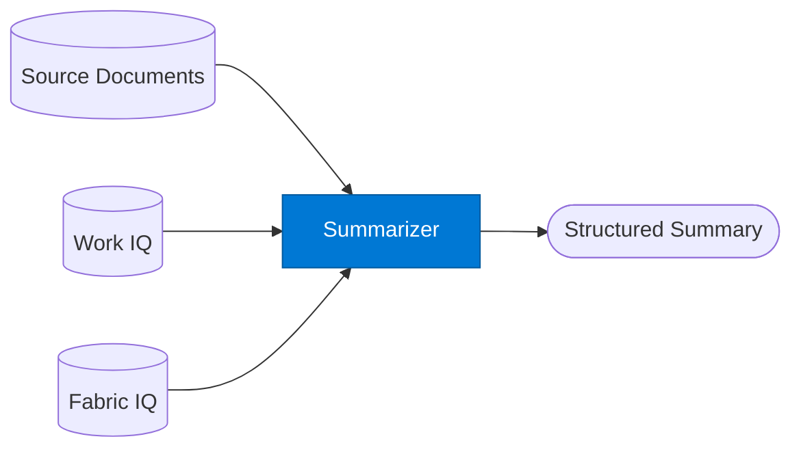

# Summarizer Agent

_Produces concise, structured summaries from documents, meeting transcripts, and datasets._

## Overview

The Summarizer takes source material — a document, a Work IQ meeting transcript, a set of retrieved chunks, or a Fabric IQ data report — and produces a structured summary at a specified level of detail. It applies org summarisation conventions from Foundry IQ and supports multiple output formats.

## Pattern Diagram



## Contract Specification

### Inputs

**summarize_request** (object, required):
- `content` (string | array, required): Text, document chunks, or array of documents to summarise
- `content_type` (string, optional): `"document"` | `"meeting"` | `"dataset"` | `"email_thread"` (default: `"document"`)
- `length` (string, optional): `"one_sentence"` | `"short"` | `"medium"` | `"detailed"` (default: `"short"`)
- `format` (string, optional): `"prose"` | `"bullets"` | `"structured"` (default: `"bullets"`)
- `focus` (string, optional): Aspect to emphasise e.g. `"action_items"`, `"decisions"`, `"risks"`

### Outputs

**summary_output** (object):
- `summary` (string | object, required): The summary in the requested format
- `word_count` (integer)
- `key_points` (array): Top 3–5 key points regardless of format
- `action_items` (array, optional): Present when `content_type == "meeting"` or `focus == "action_items"`

## Azure Tools

| Tool ID | Display Name | Service | Purpose |
|---|---|---|---|
| `iq-foundry` | Foundry IQ | Indexed org knowledge via Azure AI Search | Retrieve source documents to summarise from the knowledge index |
| `iq-work` | Work IQ | M365 signals — meetings, chats, emails, documents | Summarise M365 content — meeting transcripts, email threads, documents |
| `iq-fabric` | Fabric IQ | OneLake, Power BI semantic models and datasets | Summarise data reports and Power BI datasets |

## Usage

```python
from safe_framework.agents.standalone.summarizer import SummarizerAgent

agent = SummarizerAgent(kernel=kernel)

# Summarise a meeting
result = await agent.invoke({
    "content": meeting_transcript,
    "content_type": "meeting",
    "length": "short",
    "format": "structured",
    "focus": "action_items"
})

for item in result["action_items"]:
    print(f"- [{item['owner']}] {item['action']} by {item['due_date']}")
```

## Use Cases

1. **Meeting summaries** — extract action items and decisions from Work IQ transcripts
2. **Document digests** — summarise lengthy policy documents for quick review
3. **Data report summaries** — produce a narrative summary of a Fabric IQ data export
4. **Email thread digest** — summarise long email chains into a concise brief

## Limitations

- Very long documents (100k+ tokens) should be chunked; use `map-reduce` pattern for whole-document summarisation at scale
- `focus: "action_items"` works best with `content_type: "meeting"` or `"email_thread"`
- Summary accuracy depends on the source content quality

## Related Agents

- `rag-query` — answer a specific question rather than summarise
- `researcher` — multi-source research and synthesis
- `document-writer` — format summaries into a full .docx document

---

**Status:** Production Ready  
**Version:** 1.0  
**Framework:** SAFE 1.0  
**Last Updated:** 2026-06-21
