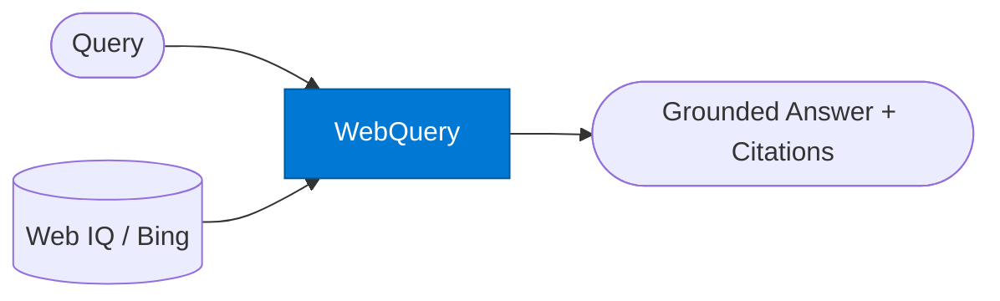

# Web Query Agent

_Searches the live public web and returns grounded answers via Bing grounding._

## Overview

The Web Query agent uses Web IQ (Bing grounding via the Foundry IQ MCP endpoint) to perform live web, news, image, and video searches. It returns a grounded answer with citations or a ranked list of results. Use it when the required information is public, current, or not available in internal org knowledge.

## Pattern Diagram



## Contract Specification

### Inputs

**web_request** (object, required):
- `query` (string, required): Search query or question
- `search_type` (string, optional): `"web"` | `"news"` | `"images"` | `"video"` (default: `"web"`)
- `top_k` (integer, optional): Number of results to retrieve (default: 5)
- `freshness` (string, optional): `"day"` | `"week"` | `"month"` | `"any"` (default: `"any"`)
- `generate_answer` (boolean, optional): Generate a synthesised answer from results (default: true)

### Outputs

**web_response** (object):
- `answer` (string, optional): Synthesised answer when `generate_answer: true`
- `results` (array): Ranked web results — `{ "title": str, "url": str, "snippet": str, "date": str }`
- `query_used` (string): Exact query sent to Bing (may differ from input after expansion)
- `result_count` (integer)

## Azure Tools

| Tool ID | Display Name | Service | Purpose |
|---|---|---|---|
| `iq-web` | Web IQ | Live public web and news via Bing grounding | Primary — Bing grounding via Foundry IQ MCP for web, news, images, and video |

## Usage

```python
from safe_framework.agents.standalone.web_query import WebQueryAgent

agent = WebQueryAgent(kernel=kernel)
result = await agent.invoke({
    "query": "EU AI Act compliance requirements for high-risk AI systems 2026",
    "search_type": "news",
    "freshness": "month",
    "top_k": 5
})

print(result["answer"])
for r in result["results"]:
    print(f"- {r['title']} ({r['date']})")
    print(f"  {r['url']}")
```

## Use Cases

1. **Regulatory monitoring** — track the latest compliance and regulatory news
2. **Competitor intelligence** — search for recent competitor announcements and press releases
3. **Technology research** — find current documentation, blog posts, and release notes
4. **Market data** — retrieve current pricing, market trends, or industry reports
5. **News briefing** — daily news summary on a topic for executive briefings

## Limitations

- Bing grounding returns public web content only — not internal org knowledge
- `freshness: "day"` may return very few results for niche topics
- Image and video search returns metadata and URLs; downloading content requires additional steps
- For queries requiring internal + external knowledge, combine with `rag-query`

## Related Agents

- `rag-query` — internal knowledge retrieval; combine with this agent for hybrid search
- `researcher` — multi-hop research that uses this agent internally
- `fallback-chain/fallback` — this agent is a common fallback when internal sources are insufficient

---

**Status:** Production Ready  
**Version:** 1.0  
**Framework:** SAFE 1.0  
**Last Updated:** 2026-06-21
